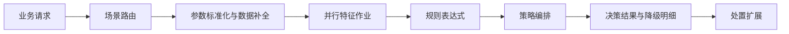

<p align="center">
  
</p>

# Soda

Soda 是一个面向业务安全与通用业务场景的开源规则引擎。它把业务方、场景、
输入参数、特征、规则和策略组织成可配置的决策流程，并通过 HTTP API 对外提供
低侵入的实时决策能力。

Soda 既可以用于登录保护、注册防刷、账号安全、名单校验等业务安全场景，也可以
用于营销资格、订单路由、价格规则、流程分支等通用业务决策场景。

> 当前版本适合本地开发、功能验证和二次开发。生产部署前需要接入正式的认证、
> 审计、持久化数据库、高可用缓存及监控告警体系。

## 核心能力

- 配置业务方和决策场景，隔离不同业务域的规则。
- 管理输入参数、工具、基础特征、统计特征和数据补全关系。
- 使用 Aviator 表达式定义可解释的布尔规则。
- 通过优先级、阈值和逻辑关系组合规则形成策略。
- 以不可变快照加载运行配置，支持定时刷新和手动原子重载。
- 通过可插拔数据补全和并行特征作业隔离外部数据源，支持统一超时与降级明细。
- 提供单笔、批量决策 HTTP API，并返回命中规则、得分和 trace ID。
- 提供可视化配置控制台和引擎调试台。
- Redis、Kafka、Elasticsearch 均为可选集成，开发环境可零中间件运行。

## 决策链路



配置修改不会直接影响正在执行的请求。Soda 会先完整构建新版本快照，成功后再
一次性替换当前版本。

## 项目结构

```text
.
├── apps/
│   └── console/                 # Vue 2 管理控制台
├── server/
│   ├── common/                  # 公共类型、缓存、监控与异常
│   ├── api/                     # 对外 DTO 与服务契约
│   ├── core/                    # 规则、特征、策略与处置核心
│   ├── config/                  # 配置实体、Mapper 与配置目录
│   ├── service/                 # 应用编排和外部适配器
│   └── web/                     # Spring Boot HTTP 入口
├── database/                    # MySQL 初始化与示例数据
├── deploy/                      # Docker 与 Nginx 配置
├── docs/                        # 架构、开发、API 和数据说明
├── examples/                    # 可直接执行的 HTTP 请求
└── tools/                       # 开源发布检查工具
```

后端 Java 根包为 `com.soda.risk.engine`，Maven 构件统一使用 `soda-*` 命名。

## 快速开始

### 环境要求

- JDK 17+
- Maven 3.9+
- Node.js 16+ 与 npm

启动后端：

```bash
mvn -f server/pom.xml clean test
mvn -f server/pom.xml -pl web -am spring-boot:run
```

启动控制台：

```bash
cd apps/console
npm ci --legacy-peer-deps
npm run dev
```

默认访问地址：

- 管理控制台：<http://localhost:8888>
- 引擎调试台：<http://localhost:8888/#/operations/playground>
- HTTP API：<http://localhost:9999>
- Swagger UI：<http://localhost:9999/swagger-ui.html>
- H2 Console：<http://localhost:9999/h2-console>

开发环境使用 H2 内存数据库和人工构造的示例数据，不依赖 MySQL、Redis、Kafka
或 Elasticsearch。更完整的说明见[快速开始](docs/quick-start.md)。

## API 示例

```bash
curl -X POST http://localhost:9999/api/v1/engine/evaluate \
  -H "Content-Type: application/json" \
  -d '{
    "requestId": "demo-001",
    "businessKey": "demo_business",
    "sceneKey": "login_protection",
    "needDetail": true,
    "data": {
      "blacklisted": true,
      "login_count": 1,
      "device_risk_score": 0
    }
  }'
```

完整请求和响应字段见 [HTTP API 文档](docs/http-engine-api.md)，可执行示例位于
[examples/requests/strategy.http](examples/requests/strategy.http)。

## 文档

| 文档 | 内容 |
| --- | --- |
| [快速开始](docs/quick-start.md) | 本地运行、Docker 启动和首次验证 |
| [技术栈](docs/technology-stack.md) | 前后端组件、版本与用途 |
| [架构设计](docs/architecture.md) | 分层、模块依赖、配置与执行链路 |
| [原始架构借鉴记录](docs/original-engine-architecture-adoption.md) | 原始工程对比、架构取舍、落地改造与验证 |
| [功能矩阵](docs/function-matrix.md) | 页面、接口和数据模型对应关系 |
| [HTTP API](docs/http-engine-api.md) | 引擎接入契约和错误码 |
| [数据库](database/README.md) | H2、MySQL 初始化和脚本说明 |
| [品牌资产](assets/brand/README.md) | Logo、favicon、导航栏和应用图标使用规范 |
| [开发指南](docs/development.md) | 编码、测试和提交前检查 |
| [验证与修复记录](docs/verification-and-fixes-next-tag.md) | 下一 tag 的功能验证矩阵、修复项和发布前检查 |
| [v2.0.0 候选发布说明](docs/tag-release-notes-v2.0.0.md) | 中文 tag 变更摘要、验证结果、兼容提示与发布清单 |
| [安全策略](SECURITY.md) | 漏洞报告与生产安全边界 |

## 参与贡献

欢迎提交 Issue、文档改进和 Pull Request。开始前请阅读
[CONTRIBUTING.md](CONTRIBUTING.md) 与 [CODE_OF_CONDUCT.md](CODE_OF_CONDUCT.md)。

## License

Soda 采用 [MIT License](LICENSE)。控制台包含来自 iView Admin 的 MIT 许可内容，
对应声明保留在 [apps/console/LICENSE](apps/console/LICENSE)。
