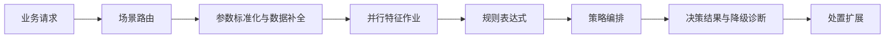

<div align="center">
  <picture>
    <source media="(prefers-color-scheme: dark)" srcset="assets/brand/lockup/soda-lockup-on-dark.png">
    <source media="(prefers-color-scheme: light)" srcset="assets/brand/lockup/soda-lockup-on-light.png">
    
  </picture>

  <p><strong>面向实时风险与通用业务决策的开源可配置规则引擎</strong></p>

  <p>
    <strong>简体中文</strong> ·
    <a href="README_EN.md">English</a>
  </p>

  <p>
    <a href="docs/tag-release-notes-v2.0.0.md"></a>
    <a href="LICENSE"></a>
    <a href="https://github.com/QuailOurs/SodaRiskEngine/stargazers"></a>
    
    
    
  </p>

  <p>
    <a href="#为什么选择-soda">核心能力</a> ·
    <a href="#架构设计">架构设计</a> ·
    <a href="#快速开始">快速开始</a> ·
    <a href="#api-示例">API 示例</a> ·
    <a href="#文档">项目文档</a> ·
    <a href="#参与贡献">参与贡献</a>
  </p>
</div>

---

## 关于 Soda

Soda 是一个面向业务安全和通用业务自动化的开源 **规则引擎（Rule Engine）** 与
**实时决策引擎（Real-time Decision Engine）**。它把业务方、场景、输入参数、
特征、规则和策略组织成可配置的决策流程，并通过低侵入的 HTTP API 对外提供服务。

Soda 可用于登录保护、注册防刷、账号安全、反欺诈和黑白名单校验，也适用于营销资格、
订单路由、价格规则、流程分支等通用业务决策场景。

> [!IMPORTANT]
> 当前版本适合本地开发、功能验证和二次开发。生产部署前需要接入正式的认证、审计、
> 持久化数据库、高可用缓存、可观测性和监控告警体系。

## 为什么选择 Soda

| 能力 | 说明 |
| --- | --- |
| 可配置决策 | 按业务方和场景隔离配置，统一管理参数、特征、规则和策略 |
| 可解释规则 | 基于 Aviator 表达式执行规则，返回命中明细、得分、返回码和 trace ID |
| 原子配置发布 | 完整构建不可变运行时快照，校验成功后一次性切换版本 |
| 弹性数据链路 | 可插拔数据补全、并行特征作业、共享超时预算和结构化降级诊断 |
| 完整 HTTP 能力 | 提供单笔/批量决策、配置重载、风险决策和处置操作接口 |
| 可视化管理 | 提供 Vue 配置控制台和可交互的引擎调试台 |
| 轻量开发体验 | H2 与内存降级可直接运行，Redis、Kafka、Elasticsearch 均为可选集成 |

## 架构设计



配置修改不会改变正在执行请求看到的数据。Soda 会先完整构建新版本的不可变快照，
校验成功后再原子替换当前版本，避免跨配置域的半更新状态。

## 快速开始

### 环境要求

- JDK 17+
- Maven 3.9+
- Node.js 16+ 与 npm

启动后端：

```bash
mvn -f server/pom.xml clean test
mvn -f server/pom.xml -pl web -am spring-boot:run
```

在另一个终端启动管理控制台：

```bash
cd apps/console
npm ci --legacy-peer-deps
npm run dev
```

| 服务 | 默认地址 |
| --- | --- |
| 管理控制台 | <http://localhost:8888> |
| 引擎调试台 | <http://localhost:8888/#/operations/playground> |
| HTTP API | <http://localhost:9999> |
| Swagger UI | <http://localhost:9999/swagger-ui.html> |
| H2 Console | <http://localhost:9999/h2-console> |

`dev` profile 使用 H2 内存数据库和人工构造的示例数据，首次运行不依赖 MySQL、
Redis、Kafka 或 Elasticsearch。Docker 和详细配置见[快速开始](docs/quick-start.md)。

> [!NOTE]
> 使用 Node.js 18 及以上版本执行测试或生产构建时，旧版 Webpack 4 工具链可能需要设置
> `NODE_OPTIONS=--openssl-legacy-provider`。

## API 示例

```bash
curl -X POST http://localhost:9999/api/v1/engine/evaluate \
  -H "Content-Type: application/json" \
  -d '{
    "requestId": "demo-001",
    "businessKey": "demo_business",
    "sceneKey": "login_protection",
    "needDetail": true,
    "data": {
      "blacklisted": true,
      "login_count": 1,
      "device_risk_score": 0
    }
  }'
```

完整请求和响应字段见 [HTTP API 文档](docs/http-engine-api.md)，可执行示例位于
[strategy.http](examples/requests/strategy.http)。

## 项目结构

```text
.
├── apps/console/                # Vue 2 管理控制台
├── server/
│   ├── common/                  # 公共类型、缓存、监控与异常
│   ├── api/                     # 对外 DTO 与服务契约
│   ├── core/                    # 规则、特征、策略、风险与处置核心
│   ├── config/                  # 配置实体、Mapper 与配置目录接口
│   ├── service/                 # 应用编排和外部适配器
│   └── web/                     # Spring Boot HTTP 入口
├── database/                    # MySQL 初始化与示例数据
├── deploy/                      # Docker 与 Nginx 配置
├── docs/                        # 架构、开发、API 与发布文档
├── examples/                    # 可直接执行的 HTTP 请求
└── tools/                       # 开源发布检查工具
```

后端 Java 根包为 `com.soda.risk.engine`，Maven 构件统一使用 `soda-*` 命名。

## 技术栈

| 范围 | 技术 |
| --- | --- |
| 后端 | Java 17、Spring Boot 3.4.5、MyBatis-Plus 3.5.7、Aviator 5.4.3 |
| 控制台 | Vue 2.6、Vue Router、Vuex、iView / View UI、Axios |
| 数据 | 开发环境 H2、生产集成 MySQL 8 |
| 可选基础设施 | Redis、Kafka、Elasticsearch、Prometheus/Micrometer |
| 测试 | JUnit 5、Mockito、Spring Boot Test、Mocha、Chai |

## 质量与验证

当前候选版本已完成：

- 96 项后端单元及集成测试，0 failure、0 error、0 skipped。
- 7 项控制台单元测试，覆盖配置 API 契约和引擎调试台。
- 后端可执行 JAR 打包、控制台 Lint 和生产构建验证。
- 清理生成目录后的开源内容检查。

详细证据见[验证与修复记录](docs/verification-and-fixes-next-tag.md)和
[v2.0.0 候选发布说明](docs/tag-release-notes-v2.0.0.md)。

## 文档

| 文档 | 内容 |
| --- | --- |
| [快速开始](docs/quick-start.md) | 本地运行、Docker 启动和首次验证 |
| [技术栈](docs/technology-stack.md) | 前后端组件、版本与用途 |
| [架构设计](docs/architecture.md) | 分层、模块依赖、配置与执行链路 |
| [原始架构借鉴记录](docs/original-engine-architecture-adoption.md) | 原始工程对比、架构取舍、落地改造与验证 |
| [功能矩阵](docs/function-matrix.md) | 页面、接口和数据模型对应关系 |
| [HTTP API](docs/http-engine-api.md) | 引擎接入契约和错误码 |
| [数据库](database/README.md) | H2、MySQL 初始化和脚本说明 |
| [品牌资产](assets/brand/README.md) | Logo、favicon、导航栏和应用图标使用规范 |
| [开发指南](docs/development.md) | 编码、测试和提交前检查 |
| [验证与修复记录](docs/verification-and-fixes-next-tag.md) | 下一 tag 的功能验证矩阵、修复项和发布前检查 |
| [v2.0.0 候选发布说明](docs/tag-release-notes-v2.0.0.md) | 中文 tag 变更摘要、验证结果、兼容提示与发布清单 |
| [安全策略](SECURITY.md) | 漏洞报告与生产安全边界 |

## 参与贡献

欢迎提交 Issue、文档改进和 Pull Request。开始前请阅读
[CONTRIBUTING.md](CONTRIBUTING.md) 与 [CODE_OF_CONDUCT.md](CODE_OF_CONDUCT.md)。

如需报告安全漏洞，请遵循 [SECURITY.md](SECURITY.md)，不要在公开 Issue 中披露可利用细节。

## License

Soda 采用 [MIT License](LICENSE)。控制台包含来自 iView Admin 的 MIT 许可内容，
对应声明保留在 [apps/console/LICENSE](apps/console/LICENSE)。
