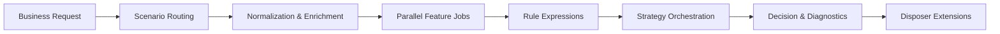

<div align="center">
  <picture>
    <source media="(prefers-color-scheme: dark)" srcset="assets/brand/lockup/soda-lockup-on-dark.png">
    <source media="(prefers-color-scheme: light)" srcset="assets/brand/lockup/soda-lockup-on-light.png">
    
  </picture>

  <p><strong>An open-source, configurable rule engine for real-time risk and business decisions.</strong></p>

  <p>
    <a href="README.md">简体中文</a> ·
    <strong>English</strong>
  </p>

  <p>
    <a href="docs/tag-release-notes-v2.0.0.md"></a>
    <a href="LICENSE"></a>
    <a href="https://github.com/QuailOurs/SodaRiskEngine/stargazers"></a>
    
    
    
  </p>

  <p>
    <a href="#why-soda">Why Soda</a> ·
    <a href="#architecture">Architecture</a> ·
    <a href="#quick-start">Quick Start</a> ·
    <a href="#api-example">API</a> ·
    <a href="#documentation">Documentation</a> ·
    <a href="#contributing">Contributing</a>
  </p>
</div>

---

## About Soda

Soda is an open-source **rule engine** and **real-time decision engine** for risk control and
general business automation. It turns business domains, scenarios, input parameters, features,
rules, and strategies into configurable decision pipelines exposed through low-coupling HTTP APIs.

It can power login protection, anti-bot registration, account security, fraud prevention, and
allowlist/blocklist checks, as well as promotion eligibility, order routing, pricing rules, and
workflow branching.

> [!IMPORTANT]
> The current version is intended for local development, functional validation, and secondary
> development. Before production deployment, integrate production-grade authentication, audit,
> persistence, high-availability caching, observability, and alerting.

## Why Soda

| Capability | What it provides |
| --- | --- |
| Configurable decisions | Isolated business domains and scenarios with parameter, feature, rule, and strategy management |
| Explainable rules | Aviator expressions with hit rules, scores, return codes, and trace IDs |
| Atomic configuration | Immutable runtime snapshots built completely before an atomic version switch |
| Resilient data pipeline | Pluggable data enrichment, parallel feature jobs, a shared timeout budget, and structured degradation details |
| Complete HTTP surface | Single and batch evaluation APIs, runtime reload, risk decisions, and disposer operations |
| Visual administration | A Vue-based configuration console and an interactive engine playground |
| Lightweight development | Runs with H2 and in-memory fallbacks; Redis, Kafka, and Elasticsearch are optional integrations |

## Architecture



Configuration changes never mutate an in-flight request's view. Soda builds a complete immutable
snapshot first and publishes it atomically only after successful validation.

## Quick Start

### Prerequisites

- JDK 17 or later
- Maven 3.9 or later
- Node.js 16 or later with npm

Start the backend:

```bash
mvn -f server/pom.xml clean test
mvn -f server/pom.xml -pl web -am spring-boot:run
```

Start the administration console in another terminal:

```bash
cd apps/console
npm ci --legacy-peer-deps
npm run dev
```

| Service | Default URL |
| --- | --- |
| Administration console | <http://localhost:8888> |
| Engine playground | <http://localhost:8888/#/operations/playground> |
| HTTP API | <http://localhost:9999> |
| Swagger UI | <http://localhost:9999/swagger-ui.html> |
| H2 Console | <http://localhost:9999/h2-console> |

The `dev` profile uses an in-memory H2 database and synthetic sample data. MySQL, Redis, Kafka,
and Elasticsearch are not required for the first run. See the
[Quick Start guide](docs/quick-start.md) for Docker and configuration details.

> [!NOTE]
> With Node.js 18 or later, the legacy Webpack 4 toolchain may require
> `NODE_OPTIONS=--openssl-legacy-provider` when running tests or production builds.

## API Example

```bash
curl -X POST http://localhost:9999/api/v1/engine/evaluate \
  -H "Content-Type: application/json" \
  -d '{
    "requestId": "demo-001",
    "businessKey": "demo_business",
    "sceneKey": "login_protection",
    "needDetail": true,
    "data": {
      "blacklisted": true,
      "login_count": 1,
      "device_risk_score": 0
    }
  }'
```

For complete request and response fields, see the [HTTP API documentation](docs/http-engine-api.md).
Executable samples are available in [strategy.http](examples/requests/strategy.http).

## Project Layout

```text
.
├── apps/console/                # Vue 2 administration console
├── server/
│   ├── common/                  # Shared types, cache, monitoring, and exceptions
│   ├── api/                     # Public DTOs and service contracts
│   ├── core/                    # Rules, features, strategies, risk, and disposers
│   ├── config/                  # Configuration entities, mappers, and catalog APIs
│   ├── service/                 # Application orchestration and external adapters
│   └── web/                     # Spring Boot HTTP entry point
├── database/                    # MySQL initialization and sample data
├── deploy/                      # Docker and Nginx configuration
├── docs/                        # Architecture, development, API, and release notes
├── examples/                    # Executable HTTP requests
└── tools/                       # Open-source release checks
```

The backend root package is `com.soda.risk.engine`, and Maven artifacts use the `soda-*` prefix.

## Technology Stack

| Area | Technologies |
| --- | --- |
| Backend | Java 17, Spring Boot 3.4.5, MyBatis-Plus 3.5.7, Aviator 5.4.3 |
| Console | Vue 2.6, Vue Router, Vuex, iView / View UI, Axios |
| Data | H2 for development, MySQL 8 for production integration |
| Optional infrastructure | Redis, Kafka, Elasticsearch, Prometheus/Micrometer |
| Testing | JUnit 5, Mockito, Spring Boot Test, Mocha, Chai |

## Quality and Validation

The current release candidate has passed:

- 96 backend unit and integration tests with no failures, errors, or skipped tests.
- 7 console unit tests, including configuration API contracts and the engine playground.
- Backend executable JAR packaging, console linting, and production builds.
- Repository open-source content checks with generated directories removed.

Detailed evidence is available in the
[validation and fix record](docs/verification-and-fixes-next-tag.md) and the
[v2.0.0 candidate release notes](docs/tag-release-notes-v2.0.0.md).

## Documentation

| Document | Description |
| --- | --- |
| [Quick Start](docs/quick-start.md) | Local run, Docker startup, and first validation |
| [Technology Stack](docs/technology-stack.md) | Components, versions, and responsibilities |
| [Architecture](docs/architecture.md) | Layers, module dependencies, configuration, and execution pipeline |
| [Original Architecture Adoption](docs/original-engine-architecture-adoption.md) | Design comparison, decisions, implementation, and validation |
| [Feature Matrix](docs/function-matrix.md) | Mapping among pages, APIs, and data models |
| [HTTP API](docs/http-engine-api.md) | Engine integration contracts and error codes |
| [Database Guide](database/README.md) | H2 and MySQL initialization |
| [Development Guide](docs/development.md) | Coding, testing, and pre-commit checks |
| [Security Policy](SECURITY.md) | Vulnerability reporting and production boundaries |

Most detailed documents are currently maintained in Simplified Chinese. English documentation
contributions are welcome.

## Contributing

Issues, documentation improvements, and pull requests are welcome. Please read
[CONTRIBUTING.md](CONTRIBUTING.md) and the [Code of Conduct](CODE_OF_CONDUCT.md) before starting.

For security vulnerabilities, follow [SECURITY.md](SECURITY.md) and do not disclose exploitable
details in a public issue.

## License

Soda is released under the [MIT License](LICENSE). The console includes MIT-licensed components
from iView Admin; the corresponding notice is retained in [apps/console/LICENSE](apps/console/LICENSE).
