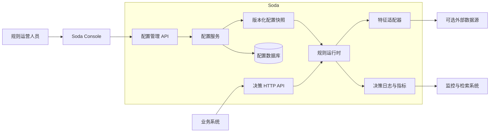
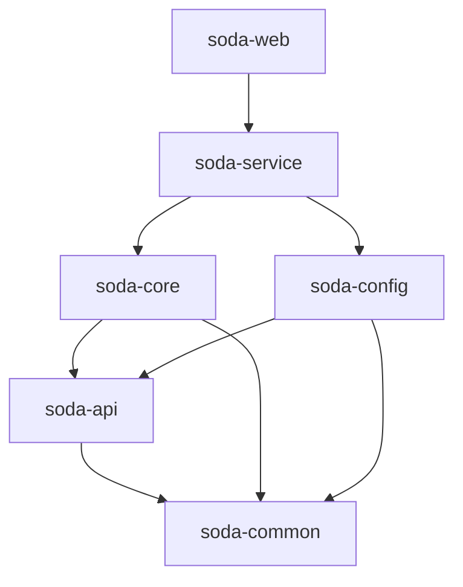
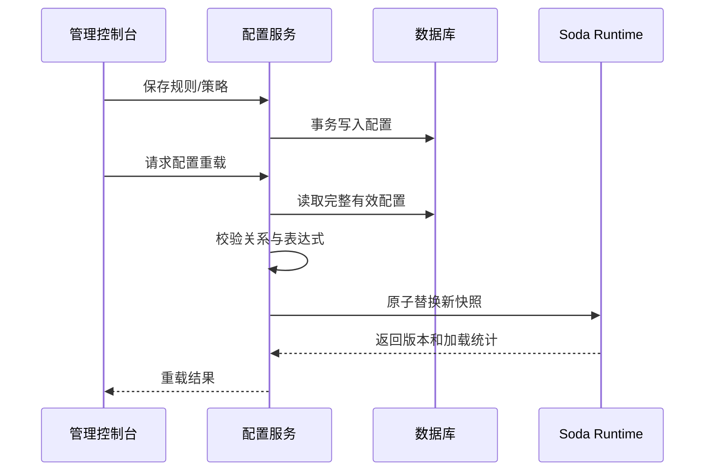
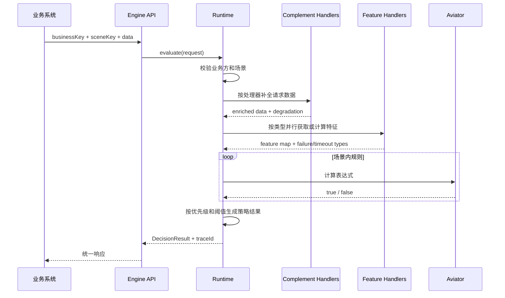

# Soda 架构设计

## 设计目标

Soda 将“配置管理”和“实时执行”分开：配置面允许业务人员维护参数、特征、规则
和策略；执行面只读取已构建完成的不可变快照，避免配置更新过程中出现半成品状态。

核心设计原则：

1. 决策请求不依赖管理控制台，可以独立部署和横向扩展。
2. 规则、策略和配置版本需要可解释、可追踪。
3. 外部数据源通过适配器接入，领域核心不绑定具体中间件。
4. 配置刷新失败时继续使用上一个有效版本。
5. 开发环境不依赖外部服务，生产集成通过 profile 和环境变量启用。

## 系统上下文

## 后端模块

后端使用 Maven 多模块组织，Java 根包统一为 `com.soda.risk.engine`。

| 目录 | Maven 构件 | 职责 | 依赖约束 |
| --- | --- | --- | --- |
| `server/common` | `soda-common` | 公共枚举、异常、缓存、日志和监控 | 不依赖业务模块 |
| `server/api` | `soda-api` | HTTP/服务 DTO 与对外契约 | 只依赖 `common` |
| `server/core` | `soda-core` | 特征、规则、策略、风险与处置领域逻辑 | 依赖 `api`、`common` |
| `server/config` | `soda-config` | 配置实体、Mapper、目录数据与同步 | 依赖 `api`、`common` |
| `server/service` | `soda-service` | 运行时快照、应用编排和外部适配器 | 依赖 `core`、`config` |
| `server/web` | `soda-web` | Spring Boot、HTTP、OpenAPI 和异常转换 | 依赖 `service` |

## 领域模型

| 概念 | 说明 |
| --- | --- |
| Business Side | 业务边界，用于隔离配置 |
| Scene | 一次决策请求所属的业务场景 |
| Parameter | 调用方输入或特征计算所需字段 |
| Feature | 可直接读取、统计、名单、画像或算法产生的数据 |
| Rule | 对参数或特征执行的单个布尔判断 |
| Strategy | 规则组合、阈值、优先级、得分与返回码 |
| Snapshot | 某一版本完整且不可变的可执行配置 |
| Decision Trace | 请求、规则结果、策略结果、版本和耗时 |
| Disposer | 命中后执行的可插拔业务动作 |

## 配置发布与加载

运行时也会按照 `soda.engine.config-refresh-ms` 周期构建快照。构建失败不会覆盖
当前有效版本。

## 决策执行流程

## 扩展点

- 新规则函数：在 `core/strategy/engine/function` 中实现并注册 Aviator 函数。
- 新数据补全源：实现 `DataComplementHandler`，只返回新增或覆盖字段。
- 新特征类型：实现 `FeatureHandler`，通过 Spring 注入处理器集合。
- 新配置同步域：注册 `ConfigSyncContributor` 并声明依赖顺序。
- 外部服务：实现 `ThirdPartyServiceAdapter`，在 `service` 层隔离协议和容错。
- 处置动作：扩展 `AbstractDisposerWayHandler`。
- 缓存与日志：实现相应适配器，保持领域模型不感知具体基础设施。

## 当前边界

- 开发 profile 使用 H2 和进程内缓存，数据在重启后重建。
- Redis、Kafka 和 Elasticsearch 集成已有接口，但不是本地运行前提。
- 演示认证只在 `dev` profile 注册；生产环境必须接入正式身份系统。
- 配置管理接口仍包含为控制台保留的兼容路径，后续版本会逐步统一为 `/api/v1`。

原始工程架构的对比、取舍和落地细节见
[原始策略引擎架构借鉴与落地记录](original-engine-architecture-adoption.md)。
