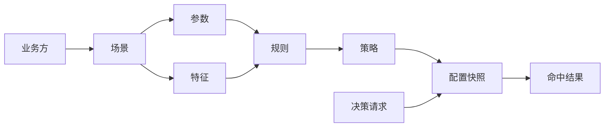

# 功能矩阵

管理控制台聚焦规则配置、业务安全决策和运行调试。下表记录页面、主要数据模型与
当前支持能力。

| 功能域 | 控制台路由 | 主要数据表或能力 | 支持操作 |
| --- | --- | --- | --- |
| 业务方 | `#/business-side/index` | `t_business_side` | 查询、新增、编辑、删除、唯一性检查 |
| 场景 | `#/scene/index` | `t_scene` | 查询、新增、编辑、删除、缓存同步 |
| 字段/参数 | `#/parameter/index` | `t_catalog_param` | 查询、新增、编辑、删除、级联选择 |
| 工具 | `#/tool/index` | `t_catalog_tool` | 查询、启用、禁用、字段选择 |
| 规则 | `#/rule/index` | `t_rule` | 查询、新增、编辑、删除、表达式配置、缓存同步 |
| 策略 | `#/strategy/index` | `t_strategy`、`t_strategy_rule_relation` | 查询、新增、编辑、状态切换、规则关联、缓存同步 |
| 基础特征 | `#/feature/index` | `t_base_info_feature` | 查询、新增、编辑、删除、类型解析、缓存同步 |
| 统计特征 | `#/feature-statistics/index` | `t_catalog_feature_statistics` | 查询、新增、编辑、状态切换、参数关联 |
| 参数补全 | `#/complement/index` | `t_catalog_complement_key` 及关系表 | 查询、新增、状态切换 |
| 风险配置 | `#/risk-config/index` | `t_risk_config` | 查询、新增、编辑、删除、缓存同步 |
| 黑白名单 | `#/black-white-list/index` | `t_black_white_list` | 查询、新增、编辑、删除、缓存替换 |
| 返回码 | `#/return-code/index` | `t_return_code` | 查询、新增、编辑、删除、按场景获取 |
| 处置方式 | `#/disposer/index` | `t_disposer_config` | 查询、新增、编辑、删除、缓存同步 |
| 引擎调试台 | `#/operations/playground` | 规则计算、风险识别、处置状态、配置同步 | 在线填写请求并查看完整响应 |

## 配置到执行链路

## 首次启动数据

开发环境仅加载小规模人工构造数据：

| 类型 | 数量 |
| --- | ---: |
| 业务方 | 2 |
| 场景 | 3 |
| 策略 | 3 |
| 规则 | 5 |
| 基础特征 | 7 |
| 参数 | 12 |
| 工具 | 6 |
| 统计特征 | 3 |
| 参数补全项 | 2 |

数据详情见[示例数据说明](sample-data.md)。

## 兼容接口说明

配置管理端部分 URL 延续了控制台既有路径，例如
`/api/strategy-engine-config-center`。这些路径是公开兼容层，不代表后端模块边界。
新增的引擎接入接口统一使用 `/api/v1/engine`。
