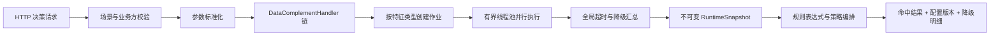

# 原始策略引擎架构借鉴与落地记录

本文记录 2026-08-24 对本地原始 `strategyEngine`、`strategyEngineConfigCenter`
与当前 Soda 项目的对比结论，以及已落地的架构优化。本文可用于代码评审、后续重构
和下一 tag 发布说明整理。

## 结论

原始工程最有价值的部分不是静态缓存 Manager，而是以下三类思想：

1. 用模板流程明确“数据补全、特征计算、规则和策略”的执行阶段。
2. 将补全源和特征类型封装为处理器/作业，允许并行执行、异常隔离和降级。
3. 将配置同步拆为有依赖顺序的配置域任务，并由统一入口编排。

Soda 已经具备更稳健的不可变 `RuntimeSnapshot` 和 `AtomicReference` 原子切换，
因此继续保留该设计，没有照搬原工程的全局可变 Manager、静态路由表和分散定时器。

## 架构取舍

| 原始设计 | 当前项目原状 | 本次处理 | 理由 |
| --- | --- | --- | --- |
| `ComputeEngine` 模板化执行阶段 | 主链路直接进入快照规则计算，兼容链路有部分预处理 | 主链路接入“补全 → 特征 → 规则/策略” | 恢复清晰阶段边界，同时不改变快照模型 |
| `ComplementHandler` 插件机制 | IP、设备补全硬编码在兼容执行器私有方法中 | 引入 `DataComplementHandler` 与统一编排服务 | 新数据源无需修改引擎，单源异常可降级 |
| 按特征类型创建异步 `FeatureJob` | 特征处理器按类型串行执行 | 使用有界线程池并行查询，返回结构化结果 | 降低多外部源叠加延迟，保留失败和超时类型 |
| 每个 Future 最多等待固定时长 | 没有查询超时 | 所有任务共享一个全局 deadline | 避免 N 类特征导致最坏耗时变成 N 倍超时 |
| 配置域更新任务按顺序派发 | Controller 和定时任务各维护一套同步顺序 | 引入 `ConfigSyncContributor` 和 `ConfigSyncCoordinator` | 消除重复编排，便于新增配置域和测试依赖顺序 |
| 多个可变 Manager 分别替换 Map | 已有不可变快照整体替换 | 保留 Soda 方案 | 整体快照能避免跨配置域的半更新状态 |
| 多个独立定时任务刷新配置域 | 运行时快照统一重载，Redis 兼容缓存另行同步 | 统一 Redis 同步协调器并禁止重叠执行 | 避免手工与定时同步互相覆盖，主决策仍以快照为准 |

## 落地后的执行链路



补全处理器只返回新增或覆盖字段，不修改调用方原始 Map。特征作业按类型并行，
成功结果按稳定顺序合并；失败、拒绝和超时不会中断其余特征或整个决策。

决策结果 `detail` 新增以下诊断字段：

| 字段 | 含义 |
| --- | --- |
| `dataPipelineDegraded` | 补全或特征阶段是否发生降级 |
| `featureCostMs` | 特征阶段总耗时 |
| `failedComplementHandlers` | 失败的补全处理器，仅降级时返回 |
| `failedFeatureTypes` | 异常、无处理器或任务拒绝的特征类型 |
| `timedOutFeatureTypes` | 超过全局 deadline 的特征类型 |

## 配置同步编排

默认配置域顺序为：

```text
scene → feature → rule → strategy → disposer → risk → black-white
```

规则先于策略写入 Redis 兼容缓存，使策略引用的规则先就绪。手工同步接口和定时任务
共用同一个协调器；某个配置域失败时会记录错误并继续其余步骤，一轮结果通过
`ConfigSyncReport` 返回。若另一轮同步正在执行，新请求会得到 `skipped=true`，不会
与已有任务重叠。

运行时决策配置不依赖上述 Redis 分步发布，仍由 `StrategyRuntimeEngine.reload()`
完整构建新快照并一次替换。Redis 同步主要服务兼容接口和其他配置消费者。

## 配置参数

| 参数 | 默认值 | 说明 |
| --- | ---: | --- |
| `soda.engine.feature-workers` | 8 | 特征查询线程数 |
| `soda.engine.feature-queue-capacity` | 256 | 特征等待队列上限 |
| `soda.engine.feature-timeout-ms` | 200 | 一次决策全部特征作业共享的超时预算 |
| `soda.engine.config-refresh-ms` | 30000 | 不可变运行时快照刷新间隔 |

## 主要代码位置

- `server/service/.../StrategyRuntimeEngine.java`：主决策模板和不可变快照。
- `server/core/.../strategy/complement/`：补全处理器、编排和降级结果。
- `server/core/.../strategy/feature/FeatureService.java`：并行特征作业和全局超时。
- `server/core/.../strategy/feature/FeatureExecutionConfiguration.java`：有界线程池。
- `server/config/.../config/sync/`：配置域贡献者、协调器和结构化报告。

## 自动化验证

新增测试覆盖：

- 两类特征通过同步门闩证明并行执行。
- 两个慢特征共享 60 ms deadline，整体不会按任务数倍增等待。
- 单类特征异常后，其他类型结果仍正常合并并标记降级。
- 特征线程池拒绝新任务时按类型降级，不向主链路抛出异常。
- 补全处理器组合、原始数据不变和单处理器异常隔离。
- 配置域依赖顺序、失败后继续执行、并发防重入、选择性同步和未知域报告。
- Spring Boot HTTP 主链路输出数据管道诊断字段，未知特征类型降级后原有命中保持通过。
- 全量同步与风险同步接口返回稳定、有序的结构化发布报告。

本轮后端全量测试共 96 项，0 failure、0 error、0 skipped。

## 后续建议

- 真实 IP、设备、画像和算法服务接入时实现现有处理器接口，并增加供应商契约测试、
  熔断指标和容量压测，不要在引擎中增加服务类型分支。
- 生产环境按外部服务延迟分布校准线程数、队列和 deadline；队列拒绝应接入告警。
- 若配置发布需要跨数据库与多节点严格一致，可在快照版本之上增加发布批次号和节点
  加载确认，不建议回退到逐个可变 Map 更新。
